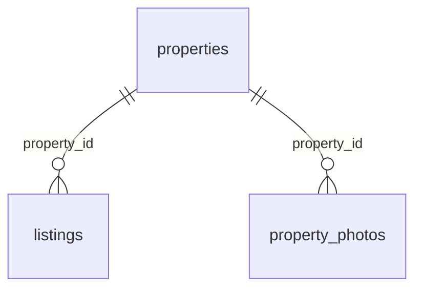
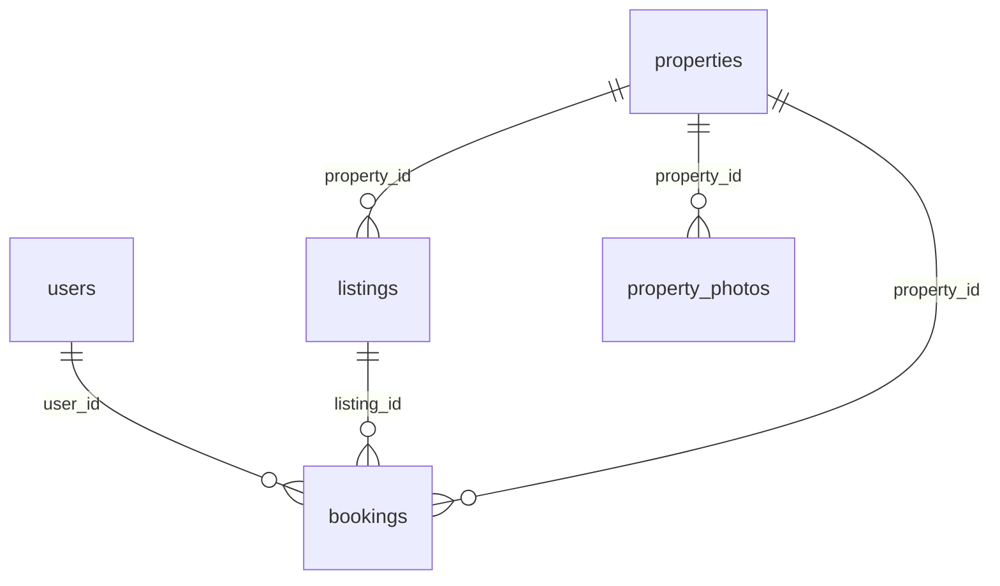

# База данных простыми словами

## Что такое SQLite

SQLite хранит таблицы в одном файле. Здесь это `data/apartments.sqlite3`. Отдельный сервер базы устанавливать и запускать не нужно: C++ вызывает функции библиотеки SQLite, а библиотека читает и записывает файл.

DB Browser for SQLite — отдельное приложение для просмотра того же файла. Оно не заменяет библиотеку, с которой собирается C++. Рабочий файл не хранится в Git: его можно воспроизвести из SQL-схемы и C++ генератора.

## Какие таблицы созданы

Таблица похожа на лист Excel: **строка** — одна запись, **столбец** — одно свойство. `id` — уникальный номер записи, первичный ключ (`PRIMARY KEY`). Не следует считать номера последовательными без пропусков.

| Таблица | Одна строка означает | Основные столбцы |
| --- | --- | --- |
| `properties` | Одну физическую квартиру или дом | `id`, `kind`, `address`, `district`, `area`, `rooms`, `floor`, `description`, `latitude`, `longitude` |
| `listings` | Одно предложение аренды или продажи | `id`, `property_id`, `deal_type`, `price`, `status`, `created_at`, `seller_user_id`, `source_booking_id` |
| `property_photos` | Одну фотографию объекта | `id`, `property_id`, `url`, `caption`, `sort_order` |
| `users` | Один зарегистрированный аккаунт | `id`, `name`, `email`, `password_hash`, `created_at` |
| `bookings` | Одно бронирование за всю историю | `id`, `user_id`, `listing_id`, `property_id`, `price_at_booking`, `deal_type`, `status`, `created_at`, `ended_at` |

В демонаборе второго этапа 1000 объектов, 1000 первоначальных объявлений, 3000 записей фотографий. Первые 12 объектов сохранены с первого этапа. Фотографии лежат в `public/images`; в базе хранится путь вида `/images/kitchen.jpg`, а не содержимое JPEG. Четыре иллюстрации переиспользуются. Их связь с учебными адресами вымышлена, координаты приблизительные.

`kind` принимает `apartment` (квартира) или `house` (дом). Площадь хранится в квадратных метрах. `floor = 0` у демонстрационных домов означает «объект целиком», а не число этажей дома. Для квартиры `floor` — её этаж.

`deal_type`: `rent` — аренда, `sale` — продажа. `price` — **целое положительное число драмов**: месячная плата при аренде или стоимость целого объекта при продаже. Целое число удобно для денег: оно не даёт ошибок двоичного округления дробных чисел.

`status`: `available` — доступно, `reserved` — забронировано, `closed` — закрыто. Каталог показывает только `available`, а отдельная страница объявления показывает любой из трёх статусов. Доступное объявление можно забронировать. Освобождение аренды возвращает то же объявление в available; перепродажа закрывает прежнее и создаёт новое.

## Зачем отделять объект от объявления

Адрес, площадь и комнаты относятся к физической квартире. Цена и тип сделки относятся к предложению. Если квартиру перепродают, это та же квартира, но уже новое предложение.

Например, квартира `properties.id = 7` может иметь закрытое объявление `listings.id = 7` и новое объявление `listings.id = 1001`. У обоих `property_id = 7`. Поэтому сохраняется история, а адрес и фотографии не приходится копировать.



Это связи «один ко многим»: у одного объекта может быть несколько объявлений за всё время и несколько фотографий. `REFERENCES properties(id)` — внешний ключ: значение `property_id` обязано указывать на существующий объект.

`ON DELETE RESTRICT` не разрешает удалить объект, пока на него ссылаются объявления или фотографии. `CHECK (price > 0)` запрещает неположительную цену. `UNIQUE (property_id, sort_order)` не даёт двум фото одного объекта занять одну позицию.

Частичный уникальный индекс `one_open_listing_per_property` запрещает два объявления одного объекта со статусом `available` или `reserved`. Закрытые строки остаются в истории. Это ограничение сохранено. В третьем этапе к нему добавлены ограничения бронирований и транзакция, описанные ниже.

## Как открыть файл в DB Browser

1. Сначала подготовьте базу командой `./build/apartment_server --init-db` из корня проекта, если ещё не запускали сервер.
2. Запустите DB Browser for SQLite → **Open Database / Открыть базу данных**.
3. Выберите `/Users/khoren/Documents/apartment-platform/data/apartments.sqlite3`.
4. В **Database Structure / Структура БД** видны пять таблиц и индексы. Раскройте таблицу, чтобы увидеть её столбцы.
5. В **Browse Data / Просмотр данных** выберите нужную таблицу из списка. Пользователи и бронирования появляются после действий через сайт.
6. В **Execute SQL / Выполнить SQL** вставьте запрос ниже и нажмите кнопку запуска ▶. `SELECT` ничего не изменяет.

```sql
SELECT id, address, district, area, rooms
FROM properties
ORDER BY id;
```

Читается так: «выбери столбцы id, адрес, район, площадь и комнаты **из** таблицы объектов и **упорядочь** по id». Вернётся 1000 строк, если база содержит только исходные данные.

Если редактируете строки вручную, нажмите **Write Changes / Записать изменения**, чтобы C++ увидел сохранённые правки. Незавершённое редактирование может удерживать блокировку базы. Для обычного просмотра сохранять ничего не нужно. При изменениях сервером обновите вкладку просмотра данных.

## Несколько полезных запросов

Количество объектов:

```sql
SELECT COUNT(*) AS object_count FROM properties;
```

`COUNT(*)` считает строки, `AS` задаёт понятное имя столбца результата.

Соединить объявление с адресом:

```sql
SELECT l.id, p.address, p.district, l.deal_type, l.price, l.status
FROM listings AS l
JOIN properties AS p ON p.id = l.property_id
ORDER BY l.id;
```

`l` и `p` — короткие имена таблиц. `JOIN ... ON` добавляет к объявлению данные того объекта, чей `id` совпал с `property_id`.

Выбрать доступную аренду до 300 000 драмов в месяц:

```sql
SELECT p.address, l.price
FROM listings AS l
JOIN properties AS p ON p.id = l.property_id
WHERE l.deal_type = 'rent' AND l.status = 'available' AND l.price <= 300000
ORDER BY l.price ASC, l.id ASC;
```

`WHERE` оставляет подходящие строки; `AND` означает «оба условия выполняются». `ASC` — по возрастанию, `DESC` — по убыванию. Второй столбец сортировки `id` задаёт однозначный порядок при равных ценах. На сайте второго этапа эти условия доступны в форме фильтров; сортировка и отбор выполняются на сервере.

Фотографии объекта № 1:

```sql
SELECT url, caption, sort_order
FROM property_photos
WHERE property_id = 1
ORDER BY sort_order;
```

Проверка ссылок и файла:

```sql
PRAGMA foreign_key_check;
PRAGMA integrity_check;
```

Первый запрос при отсутствии нарушений не возвращает строк; второй должен вернуть `ok`.

## Как C++ выполняет SQL

Путь одного запроса:

1. `public/app.js` вызывает `fetch('/api/listings?type=rent')`.
2. Drogon находит обработчик `/api/listings` в `src/main.cpp`.
3. C++ проверяет все параметры, создаёт `ListingFilters` и открывает `Database` для нужного файла.
4. Конструктор `Database` выполняет `PRAGMA foreign_keys = ON` и проверяет результат. Это требуется **для каждого соединения**: включение в DB Browser не включает его в C++ и наоборот. [Документация SQLite](https://www.sqlite.org/foreignkeys.html).
5. `Database::listings` в `src/database.cpp` считает подходящие объявления и выбирает страницу. Затем присоединяет фото; `LEFT JOIN` сохраняет объявление даже при отсутствии фотографий. Все значения передаются параметрами.
6. C++ собирает строки в `std::vector<Listing>`, преобразует в JSON и возвращает HTTP-ответ.
7. JavaScript создаёт карточки через DOM и `textContent`. В браузере нет SQL и хардкодированного списка квартир.

Суть параметризованного запроса:

```cpp
Statement query(db.handle(), "SELECT id FROM listings WHERE deal_type = ?1");
query.bind(1, std::string("rent"));
while (query.step()) {
    auto id = query.integer(0);
    // Используем полученный id.
}
```

`?1` — место для первого значения, `bind` передаёт значение отдельно от текста SQL. Даже кавычки внутри значения останутся данными и не станут новой SQL-командой. Нельзя строить SQL склеиванием с текстом пользователя. Внутри небольшой обёртки используются `sqlite3_prepare_v2`, `sqlite3_bind_*`, `sqlite3_step`, `sqlite3_finalize`.

Обёртка `Statement` освобождает запрос в деструкторе; `Database` закрывает соединение в деструкторе. Это RAII — привязка ресурса ко времени жизни C++ объекта. В проекте нет собственного ORM или многоэтажных слоёв сервисов. Фиксированные команды схемы и транзакций выполняются через `execute`; входные значения — только через `bind`.

## Создание базы и повторный запуск

`PRAGMA user_version` — число версии схемы внутри файла SQLite. Это встроенное свойство базы, отдельная служебная таблица не нужна. Новая база имеет версию 0. C++ выполняет `sql/001_initial.sql` внутри транзакции, создаёт таблицы и устанавливает версию 1. Затем `sql/002_catalog_indexes.sql` добавляет индексы и устанавливает версию 2. Третья миграция `sql/003_users_bookings.sql` создаёт пользователей и бронирования и устанавливает версию 3. Четвёртая миграция `sql/004_resale_origin.sql` добавляет происхождение объявления и устанавливает версию 4. Если база имела версию 2, выполняются третья и четвёртая; если версию 3 — только четвёртая. При повторном запуске схема не создаётся заново. Неизвестная версия приводит к понятной ошибке; сервер не пытается молча пересоздать файл.

Изменения схемы на следующих этапах нужно оформлять новыми миграциями, а не удалением пользовательской базы. `001_initial.sql` описывает первоначальную версию, а не сброс данных.

`src/seed.cpp` — воспроизводимый генератор 1000 объектов. Первые 12 описаны явно, остальные вычисляются по постоянным формулам от номера. Ключи идут от `demo-001` до `demo-1000`; число строк всей базы не используется как ограничение. Пользовательские объекты и новые объявления одного объекта могут увеличивать общий счёт сверх 1000. Дата `created_at` соответствует реальному первому запуску и при повторном заполнении сохраняется. `demo_key` (например, `demo-001`) — постоянная метка демонстрационной записи. `INSERT ... ON CONFLICT(demo_key) DO NOTHING` означает «если такая метка уже есть, пропусти вставку». Для существующего объекта генератор также пропускает его объявления и фотографии. Он не исправляет вручную удалённые дочерние строки и не восстанавливает старую цену. При полном удалении демонстрационного объекта с дочерними строками его метка исчезнет и следующая подготовка создаст его снова.

Все новые демообъекты вставляются в одной транзакции:

- `BEGIN IMMEDIATE` начинает операцию записи и получает блокировку писателя.
- Вставляются связанные объекты, объявления и фото.
- `COMMIT` сохраняет весь набор.
- При ошибке `ROLLBACK` отменяет все вставки этого запуска. Половина набора не останется в базе.

Транзакция — «всё или ничего». SQLite допускает одного писателя одновременно; при подготовке базы `busy_timeout = 5000` позволяет подождать освобождения блокировки до пяти секунд. Для пользовательских действий установлен более короткий срок 250 мс за попытку и ограниченный повтор всей транзакции, как описано ниже. Ожидание не заменяет проверку прав и условий действия.

## Как работает полный каталог второго этапа

Полные запросы, готовые для DB Browser: [catalog-queries.sql](catalog-queries.sql). Они только читают данные. В примерах ниже стоят конкретные значения; в C++ вместо них используются `?` и `Statement::bind`.

### WHERE и AND: оставить только подходящие объявления

```sql
SELECT l.id, p.address, p.district, p.rooms, l.price, p.area
FROM listings AS l
JOIN properties AS p ON p.id = l.property_id
WHERE l.status = 'available'
  AND l.deal_type = 'rent'
  AND p.district = 'Кентрон'
  AND l.price >= 200000
  AND l.price <= 500000
  AND p.rooms = 2
ORDER BY l.price ASC, l.id ASC
LIMIT 24 OFFSET 0;
```

Читаем последовательно: взять объявления и их объекты; оставить доступную аренду в Кентроне, с двумя комнатами и ценой от 200 000 до 500 000 драмов включительно; упорядочить и показать первые 24.

`WHERE` начинает условия отбора, `AND` требует выполнения **всех** условий одновременно. Поэтому выбор района не отменяет цену или комнаты. Границы цены включены благодаря `>=` и `<=`. Комнаты и район сравниваются точно через `=`. Невыбранный фильтр вообще не добавляется в SQL: в `whereClause` дописываются только фиксированные фрагменты, а `bindFilters` передаёт значения в том же порядке. Ни район, ни цена не склеиваются с текстом SQL.

### ORDER BY: выбрать порядок всего результата

В API есть четыре значения `sort`:

| Значение | SQL внутри выборки страницы |
| --- | --- |
| `price_asc` | `ORDER BY l.price ASC, l.id ASC` |
| `price_desc` | `ORDER BY l.price DESC, l.id ASC` |
| `area_asc` | `ORDER BY p.area ASC, l.id ASC` |
| `area_desc` | `ORDER BY p.area DESC, l.id ASC` |

Цена хранится в `listings`, площадь — в `properties`, поэтому используются разные короткие имена таблиц. `ASC` — от меньшего к большему, `DESC` — от большего к меньшему. Во всех четырёх вариантах дополнительный `l.id ASC` одинаков: при равенстве основного значения первым идёт объявление с меньшим номером.

Сортировку выполняет SQLite **до** разделения на страницы. Если отсортировать только 24 карточки в JavaScript, нельзя гарантировать, что на следующей странице не окажется более дешёвое предложение. Для нашего каталога серверная сортировка даёт правильный общий порядок.

Имена столбцов и `ASC`/`DESC` не передаются как обычные значения `?`. В C++ есть явный белый список четырёх готовых фрагментов SQL. Строка вроде `sort=price;DROP TABLE listings` не принадлежит списку и получает HTTP 400.

### LIMIT и OFFSET: взять одну страницу

`LIMIT 24` означает «вернуть не больше 24 объявлений», `OFFSET 24` — «пропустить первые 24». Формула в C++:

```text
offset = (page - 1) * page_size
```

Для первой страницы смещение 0, для второй 24, для третьей 48. Полный пример второй страницы по убыванию площади:

```sql
SELECT l.id, p.address, p.area, l.price
FROM listings AS l
JOIN properties AS p ON p.id = l.property_id
WHERE l.status = 'available'
ORDER BY p.area DESC, l.id ASC
LIMIT 24 OFFSET 24;
```

`LIMIT` и `OFFSET` тоже связываются параметрами. Сервер разрешает `page_size` от 1 до 100 и `page` от 1 до 1 000 000; расчёт использует 64-битное целое. Далёкая допустимая страница возвращает пустой список, а не ошибку 500. Размер страницы по умолчанию — 24.

`OFFSET` выбран за простоту и возможность переходить сразу к номеру страницы. При миллионах строк и больших смещениях он может быть затратным: движку приходится проходить пропускаемые записи. Тогда имеет смысл рассмотреть пагинацию по последнему значению сортировки и id, но для учебных 1000 объектов это лишнее усложнение.

### COUNT: узнать общее число совпадений

```sql
SELECT COUNT(*) AS total
FROM listings AS l
JOIN properties AS p ON p.id = l.property_id
WHERE l.status = 'available'
  AND l.deal_type = 'rent'
  AND p.district = 'Кентрон'
  AND l.price >= 200000
  AND l.price <= 500000
  AND p.rooms = 2;
```

`COUNT(*)` считает строки после `WHERE`. Здесь нет `LIMIT/OFFSET`, потому что нужно число **всех** совпадений. Фотографии тоже не присоединяются: иначе три фото могли бы утроить счётчик.

API возвращает `total` — все совпадения, `count` — объявления текущей страницы. Число страниц считается как `(total + page_size - 1) / page_size` с целочисленным делением. Для 1000 и 24 это 42 страницы: 41 полная и последняя из 16 объявлений. При `total = 0` страниц 0.

`COUNT` и запрос страницы выполняются в одной транзакции чтения (`BEGIN` → два SELECT → `COMMIT`). Так внутри одного ответа список и количество относятся к одному снимку базы. Между разными HTTP-запросами данные могут измениться, и страницы со смещением могут сдвинуться. Стабильный `id` разрешает равенство цен, но не замораживает базу навсегда.

### Почему фотографии присоединяются после LIMIT

В фактическом запросе C++ используется `WITH page AS (...)`. Это временное имя результата **одного запроса**, не новая сохранённая таблица. Внутри `page` выбираются и сортируются объявления, затем применяются `LIMIT/OFFSET`. Снаружи выполняется:

```sql
-- Этот фрагмент завершает WITH page AS (...), полный запрос — № 2 в catalog-queries.sql.
SELECT page.*, ph.url, ph.caption
FROM page
LEFT JOIN property_photos AS ph ON ph.property_id = page.property_id
ORDER BY page.price ASC, page.id ASC, ph.sort_order ASC;
```

Внешняя сортировка соответствует выбранной внутренней и добавляет порядок фотографий. Для 24 объявлений с тремя фото SQL вернёт 72 строки. `readListings` в C++ объединит соседние строки с одинаковым `id` в один `Listing` с массивом фото. Итоговый JSON содержит 24 объявления. `LEFT JOIN` сохраняет строку даже при отсутствии фото — тогда массив пустой, интерфейс показывает заглушку.

### Индексы и EXPLAIN QUERY PLAN

Индекс похож на отдельный упорядоченный указатель: он помогает найти нужные строки, не перебирая всю таблицу. Индекс занимает место и требует обновления при записи, поэтому создавать индекс на каждое возможное сочетание полей не нужно. SQLite выбирает план с учётом запроса и доступных индексов; оценка также может учитывать статистику. [Описание планировщика SQLite](https://www.sqlite.org/queryplanner.html).

Миграция 2 добавляет:

| Индекс | Поля | Для каких запросов |
| --- | --- | --- |
| `listings_available_price` | `(price, id)`, только `available` | Цена и сортировка доступного каталога без выбранной сделки |
| `listings_available_type_price` | `(deal_type, price, id)`, только `available` | Равенство типа сделки плюс диапазон/порядок цены |
| `properties_district_rooms` | `(district, rooms, id)` | Поиск по району, в том числе вместе с комнатами |

Порядок полей составного индекса важен: сначала район, внутри района — комнаты. Поэтому этот индекс полезен для района и пары район+комнаты, но не является специально подобранным индексом для одного только числа комнат. Два ценовых индекса нужны для разных условий: индекс, начинающийся с типа сделки, не задаёт единого порядка цены среди обеих сделок сразу.

Сохраняются индексы первого этапа: `listings_property_id` для связи, уникальный `one_open_listing_per_property` для целостности, автоматический уникальный индекс фотографий `(property_id, sort_order)`, индексы `demo_key` и первичные ключи.

Пример только для чтения:

```sql
EXPLAIN QUERY PLAN
SELECT l.id, p.address, l.price
FROM listings AS l
JOIN properties AS p ON p.id = l.property_id
WHERE l.status = 'available'
ORDER BY l.price ASC, l.id ASC
LIMIT 24 OFFSET 0;
```

`SEARCH ... USING INDEX` означает поиск с помощью индекса. `SCAN ... USING INDEX` — проход по индексу, например в порядке цены. `USE TEMP B-TREE FOR ORDER BY` означает отдельную временную сортировку. Это описание способа выполнения, а не замер времени. [Справка EXPLAIN QUERY PLAN](https://www.sqlite.org/eqp.html).

На нашем фактическом наборе и SQLite 3.53.4 выполнены восемь планов: [query-plans.md](query-plans.md). Для цены по возрастанию выбран ценовой индекс; для типа+диапазона — составной индекс; район+комнаты используют `properties_district_rooms`. Для площади используется временная сортировка. При `price DESC, id ASC` также нужна досортировка равных цен: обратный проход по индексу сам по себе дал бы `id DESC`. После присоединения фото план содержит дополнительную сортировку их порядка.

Отдельный индекс площади сейчас не добавлен: площадь и id объявления находятся в разных таблицах, и один такой индекс не гарантирует устранение сортировки соединённого результата. Это разумный небольшой набор индексов для текущих запросов, а не утверждение об универсально самом быстром способе. При росте данных следует повторить планы и измерить время на реальной нагрузке.

## Пользователи: таблица users

Миграция 3 добавляет две таблицы, не пересоздавая старые. Схема — устройство таблиц, миграция — однократное изменение этого устройства. C++ читает `PRAGMA user_version` и выполняет только отсутствующие SQL-файлы внутри транзакции. Генератор демонстрационных объектов не добавляет пользователей и не меняет бронирования.

| Поле | Смысл и ограничение |
| --- | --- |
| `id INTEGER PRIMARY KEY` | Уникальный номер аккаунта |
| `name TEXT NOT NULL` | Имя, 2–80 символов; сервер убирает пробелы по краям и отвергает управляющие знаки |
| `email TEXT NOT NULL UNIQUE` | Нормализованный email: без пробелов по краям, латинские буквы в нижнем регистре; CHECK проверяет нормализацию и длину 3–254 |
| `password_hash TEXT NOT NULL` | Результат Argon2id, включая соль и параметры; не исходный пароль |
| `created_at TEXT NOT NULL` | Время регистрации UTC, например `2026-09-12T09:00:00Z`; SQLite подставляет текущее время |

Пример нормализации: ` Alice@Example.COM ` становится `alice@example.com`. Форма поддерживает обычные адреса ASCII; проверку структуры адреса делает C++, потому что SQL CHECK здесь проверяет лишь нормализацию/длину. Пароль не нормализуется и не обрезается.

Хеширование в `security.cpp` выполняет библиотека libsodium. В `accounts.cpp` сохранение уже подготовленных данных выглядит так:

```sql
INSERT INTO users(name, email, password_hash) VALUES (?, ?, ?);
```

Каждое `?` заполняется через `Statement::bind`. При двух одновременных регистрациях нельзя полагаться только на предварительный SELECT: оба запроса могли бы не увидеть аккаунт. Финальное решение принимает `UNIQUE(email)`. Один INSERT проходит, другой получает `SQLITE_CONSTRAINT_UNIQUE`; C++ переводит именно эту ошибку в 409 «Этот email уже зарегистрирован». Ошибка блокировки БД имеет другой код и не выдаётся за дубликат.

При входе C++ выполняет параметризованный запрос:

```sql
SELECT id, name, email, password_hash, created_at
FROM users
WHERE email = ?;
```

Далее пароль проверяет libsodium, а не SQL-сравнение с исходной строкой. Браузер получает только `id`, `name`, `email`, `created_at`. Сессия содержит номер проверенного пользователя. Запись о сессии хранится в памяти C++, отдельной таблицы `sessions` в этой схеме нет.

## Бронирования: таблица bookings

Строка отвечает на вопросы «кто», «какое объявление», «какой объект», «по какой цене», «когда» и «действует ли сейчас».

| Поле | Смысл и ограничение |
| --- | --- |
| `id INTEGER PRIMARY KEY` | Уникальный номер бронирования |
| `user_id INTEGER NOT NULL` | Внешний ключ на `users.id`; сервер берёт его из сессии |
| `listing_id INTEGER NOT NULL` | Номер конкретного предложения, к которому относится история |
| `property_id INTEGER NOT NULL` | Внешний ключ на физическую недвижимость `properties.id` |
| `price_at_booking INTEGER NOT NULL` | Положительное целое число драмов, скопированное из объявления в момент бронирования |
| `deal_type TEXT NOT NULL` | Снимок типа сделки: `rent` или `sale`; поясняет, цена месячная или за весь объект |
| `status TEXT NOT NULL` | `active` — активно; `released` — освобождено; `resold` — выставлено на перепродажу |
| `created_at TEXT NOT NULL` | Время создания в UTC, подставляется SQLite |
| `ended_at TEXT` | Время завершения; `NULL` у активной записи, обязательно заполнено у завершённой |

`NULL` означает отсутствие значения, а не пустую строку или ноль. CHECK в схеме связывает `status` с `ended_at`: активная запись не может иметь дату завершения, завершённая обязана её иметь. При бронировании сервер создаёт `active`, при освобождении меняет его на `released`, при перепродаже — на `resold`, одновременно заполняя `ended_at`. Исходная цена, пользователь и дата создания не меняются.



Все связи используют `ON DELETE RESTRICT`: нельзя удалить пользователя, объект или объявление, если это разрушило бы существующую историю. На **каждом** соединении конструктор `Database` включает `PRAGMA foreign_keys = ON` до начала транзакции и проверяет результат. Настройка одного соединения не включает её автоматически для остальных, в том числе для DB Browser.

Дополнительно есть составной внешний ключ:

```sql
FOREIGN KEY (listing_id, property_id)
REFERENCES listings(id, property_id) ON DELETE RESTRICT
```

Он не позволяет сослаться на объявление квартиры № 1, одновременно записав `property_id` квартиры № 2. Для него в `listings` создан `UNIQUE INDEX listings_id_property ON listings(id, property_id)` — SQLite требует уникальности всей пары, на которую ссылается такой ключ.

## Почему история не мешает новому бронированию

Главное ограничение — **частичный уникальный индекс**:

```sql
CREATE UNIQUE INDEX one_active_booking_per_listing
ON bookings(listing_id) WHERE status = 'active';
```

«Уникальный» означает, что одинаковый номер объявления нельзя записать дважды. «Частичный» означает, что проверяются только строки `active`. Завершённых строк одного объявления может быть много. Обычный `UNIQUE(listing_id)` запретил бы новому жильцу арендовать квартиру после освобождения, поэтому здесь он не подходит. [Частичные индексы SQLite](https://www.sqlite.org/partialindex.html).

Есть и `one_active_booking_per_property` на `property_id WHERE status = 'active'`: он исключает два активных бронирования физического объекта даже через разные объявления. Сохраняется прежний `one_open_listing_per_property`: у объекта максимум одно объявление `available` или `reserved`.

При освобождении одной транзакцией завершается старая запись и то же объявление возвращается в `available`. Старое бронирование остаётся в истории; новый пользователь создаёт новую строку. При перепродаже сервер завершает старое бронирование, закрывает старое объявление и создаёт новое. Эти действия реализованы в `src/accounts.cpp`, подробный разбор ниже.

`bookings_user_id(user_id, id)` помогает найти записи конкретного пользователя и показать новые первыми. `bookings_listing_property(listing_id, property_id)` помогает при проверке ссылок на объявления, включая историю. Индексы ускоряют нужные чтения и обеспечивают ограничения, но занимают место и обновляются при записи. Их выбор связан с нашими запросами, а не с универсальным правилом «чем больше, тем лучше».

## Транзакция на примере Алисы и Боба

Квартира `properties.id = 1` имеет объявление `listings.id = 1` с арендой 280000 драмов в месяц и три фотографии `property_photos.property_id = 1` (это исходные демоданные). Алиса и Боб — условные зарегистрированные пользователи; генератор их не создаёт.

**Без защиты** оба могут прочитать «доступно» почти одновременно. Пока Алиса обрабатывает свой SELECT, Боб тоже увидит старый статус. Если каждый затем безусловно создаст запись, получится два претендента. Отключение кнопки Боба в браузере не меняет SQL и не защищает от другого окна, приложения или соединения.

`Database::book` в `src/accounts.cpp` выполняет следующие команды как **одну транзакцию**. Это объяснение серверного действия, а не инструкция менять рабочую базу в DB Browser:

```sql
BEGIN IMMEDIATE;

SELECT seller_user_id FROM listings WHERE id = ?;

UPDATE listings
SET status = 'reserved'
WHERE id = ? AND status = 'available'
  AND (seller_user_id IS NULL OR seller_user_id != ?);

INSERT INTO bookings(user_id, listing_id, property_id, price_at_booking, deal_type)
SELECT ?, id, property_id, price, deal_type
FROM listings
WHERE id = ?;

COMMIT;
```

Между UPDATE и INSERT C++ обязательно проверяет `sqlite3_changes(db_) == 1`. Это число изменённых строк, а не число строк всего объявления. Если изменено ноль, вставка **не выполняется**, происходит ROLLBACK и ответ 409. Предварительный SELECT внутри этой транзакции отличает отсутствие объявления (404) от занятого (409) и позволяет запретить покупку у себя (403): если seller_user_id совпадает с пользователем сессии, действие отклоняется. Последний параметр UPDATE — тот же пользователь из сессии. `user_id` берётся только из проверенной сессии; цену и тип SELECT копирует из SQLite внутри той же транзакции.

`BEGIN IMMEDIATE` заранее получает право записи. Если Алиса первая его получила, Боб ждёт освобождения блокировки. Алиса меняет статус, создаёт бронирование и делает COMMIT. После этого Боб выполняет свою условную команду UPDATE и получает ноль изменённых строк: состояние уже `reserved`. Алиса получает 201, Боб — 409 «Это жильё уже забронировали». Уникальные индексы дополнительно запрещают дубли даже при ошибочном прямом INSERT. Гарантия действует для независимых соединений SQLite; она не основана на mutex одного процесса. [Транзакции SQLite](https://www.sqlite.org/lang_transaction.html).

Если INSERT Алисы завершился ошибкой, обработчик делает **ROLLBACK**. Он отменяет и UPDATE, поэтому квартира снова доступна и не остаётся `reserved` без записи о бронировании. Успех возвращается только после COMMIT. В HTTP-тесте для проверки намеренно создан триггер, отклоняющий INSERT после UPDATE; после ответа 500 база проверена на прежний статус и отсутствие бронирования.

Для `SQLITE_BUSY`/`SQLITE_LOCKED` предусмотрены максимум четыре попытки всей транзакции. На каждой SQLite ждёт до 250 мс, между попытками — 25/50/75 мс. Если блокировку держит, например, незавершённое редактирование в DB Browser, после исчерпания ожидания сайт отвечает **503**, а не 409 и не успехом. Пользователь может повторить действие. Длительная блокировка не доказывает, что объект забронировали. Гонки на свободной базе проверены отдельно: два синхронно стартующих HTTP-запроса, один 201 и один 409, одна активная запись и правильный владелец.

## Как «Мои бронирования» получает свои данные

В HTTP-обработчике C++ проверяет cookie в `SessionStore` и получает `session.userId`. Только этот номер передаётся в `bookingsForUser`:

```sql
SELECT b.id, b.user_id, b.listing_id, b.property_id, b.price_at_booking,
       b.deal_type, b.status, b.created_at, COALESCE(b.ended_at, ''), r.id
FROM bookings AS b
LEFT JOIN listings AS r ON r.source_booking_id = b.id
WHERE b.user_id = ?
ORDER BY b.id DESC;
```

`COALESCE(ended_at, '')` заменяет отсутствие даты пустой строкой для C++ структуры; в JSON незаполненная дата снова возвращается как `null`. `LEFT JOIN` находит новое объявление после перепродажи, а при его отсутствии сохраняет строку бронирования с `r.id = NULL`. В JSON этот номер называется `resale_listing_id`; по нему кабинет строит ссылку. Для каждой записи вызывается уже существующий `listing(listing_id)`, который получает характеристики и фотографии объекта. Это простой понятный код, но при большом числе бронирований потребуются пагинация и оптимизация числа запросов.

Передать чужой `user_id` в query или JSON нельзя: API отвергает такие параметры. Браузер не выбирает владельца. После бронирования интерфейс показывает цену `price_at_booking`, а не потенциально изменившуюся `listings.price`.

## Запросы третьего этапа для DB Browser — только чтение

Все запросы ниже полные и ничего не меняют. В рабочей базе `users` и `bookings` могут быть пустыми до вашей регистрации и первого бронирования.

Пользователи без показа хешей:

```sql
SELECT id, name, email, created_at
FROM users
ORDER BY id;
```

История бронирований с владельцем и объектом:

```sql
SELECT b.id AS booking_id, u.name, u.email,
       p.address, p.district, b.listing_id,
       b.deal_type, b.price_at_booking, b.status,
       b.created_at, b.ended_at
FROM bookings AS b
JOIN users AS u ON u.id = b.user_id
JOIN listings AS l ON l.id = b.listing_id AND l.property_id = b.property_id
JOIN properties AS p ON p.id = b.property_id
ORDER BY b.id DESC;
```

Бронирования пользователя № 1 (замените 1 своим номером из users):

```sql
SELECT b.id, p.address, b.price_at_booking, b.deal_type,
       b.status, b.created_at
FROM bookings AS b
JOIN properties AS p ON p.id = b.property_id
WHERE b.user_id = 1
ORDER BY b.id DESC;
```

Объект, объявление и его активный владелец, если он есть:

```sql
SELECT p.id AS property_id, p.address, l.id AS listing_id,
       l.price, l.status AS listing_status,
       b.id AS booking_id, b.price_at_booking, u.name AS booked_by
FROM properties AS p
JOIN listings AS l ON l.property_id = p.id
LEFT JOIN bookings AS b ON b.listing_id = l.id AND b.status = 'active'
LEFT JOIN users AS u ON u.id = b.user_id
WHERE p.id = 1
ORDER BY l.id;
```

`LEFT JOIN` сохраняет строку объекта даже при отсутствии бронирования: поля `booking_id` и `booked_by` тогда будут NULL. Обычный JOIN вернул бы только объекты, для которых соответствующая запись найдена.

Поиск недопустимых активных дублей (правильный результат — пусто):

```sql
SELECT listing_id, COUNT(*) AS active_count
FROM bookings
WHERE status = 'active'
GROUP BY listing_id
HAVING COUNT(*) > 1;
```

`GROUP BY` собирает записи одного объявления в группу; `HAVING` оставляет только группы с числом больше одного. Индекс в нашей схеме не позволяет таким группам появиться.

Проверка соответствия статуса объявления наличию активной записи:

```sql
SELECT l.id, l.status, COUNT(b.id) AS active_bookings
FROM listings AS l
LEFT JOIN bookings AS b ON b.listing_id = l.id AND b.status = 'active'
GROUP BY l.id, l.status
HAVING (l.status = 'reserved' AND COUNT(b.id) != 1)
    OR (l.status != 'reserved' AND COUNT(b.id) != 0);
```

Через реализованный API этот запрос должен давать пустой результат. Если раньше вы вручную меняли статус в DB Browser, запрос может обнаружить такую старую несогласованность: миграция намеренно не исправляет и не сбрасывает пользовательские изменения. Произвольное ручное редактирование обходит серверную транзакцию; внешние ключи и уникальные индексы сами по себе не заменяют её.

Посмотреть фактические определения новых таблиц и индексов:

```sql
SELECT type, name, sql
FROM sqlite_master
WHERE tbl_name IN ('users', 'bookings')
ORDER BY type, name;
```

Сведения о сессиях, CSRF, сроках, HTTPS и ограничении входа находятся в [README](../README.md). Освобождение аренды и перепродажа с сохранением истории разобраны ниже; избранное, рекомендации и ML пока не реализованы.

## Четвёртый этап: происхождение объявления

Новых таблиц на этом этапе нет: остаются `properties`, `listings`, `property_photos`, `users`, `bookings`. Миграция **004_resale_origin.sql** добавляет два поля в `listings` через `ALTER TABLE`. C++ сначала читает `PRAGMA user_version`; если там 3, выполняет только миграцию 4 в транзакции. При версии 4 этот SQL больше не выполняется. Старые миграции не изменяются, строки и прежние значения сохраняются.

| Новое поле | Назначение |
| --- | --- |
| `seller_user_id INTEGER` | Продавец нового объявления, внешний ключ на `users.id` |
| `source_booking_id INTEGER` | Бронирование покупки, на основании которого создана перепродажа; внешний ключ на `bookings.id` |

У первоначальных объявлений оба значения `NULL`: генератор не назначает им реального продавца. У перепродажи заполнены оба. `CHECK` запрещает заполнить только одно из этих полей; у нового объявления с происхождением должны быть `deal_type = 'sale'`, `demo_key IS NULL` и цена не выше 1 000 000 000 000. Нижняя граница и целочисленный тип цены уже проверяются исходной схемой. C++ независимо проверяет весь диапазон **1–1 000 000 000 000 включительно** до записи.

Внешний ключ доказывает существование продавца и бронирования. Принадлежность бронирования продавцу, тип сделки, его активность и совпадение объекта проверяет C++ внутри транзакции; сами два новых внешних ключа не заменяют эти проверки. `ON DELETE RESTRICT` сохраняет историю ссылок.

```sql
CREATE UNIQUE INDEX one_resale_per_booking
ON listings(source_booking_id) WHERE source_booking_id IS NOT NULL;
```

Индекс запрещает **любые два** объявления, происходящие от одного бронирования, даже если одно из них уже закрыто. Первоначальные объявления с `NULL` ему не мешают. Старые индексы по-прежнему запрещают два активных бронирования объявления/объекта и два незакрытых объявления объекта. `listings_seller(seller_user_id)` помогает при проверке внешнего ключа на пользователя; `one_resale_per_booking` также помогает найти ссылку на перепродажу для кабинета. Индексы дополняют проверки C++, сохраняя ограничения при независимых соединениях SQLite.

Связь можно прочитать в обе стороны:

```text
новое listings.source_booking_id → bookings.id → bookings.listing_id → старое listings.id
новое listings.seller_user_id    → users.id
старое и новое listings.property_id → одна и та же properties.id → её property_photos
```

Например (номера условные): Алиса купила объявление № 2 по цене 48 000 000, получив бронирование № 10. При перепродаже за 55 000 000 создаётся объявление № 1001: `source_booking_id = 10`, `seller_user_id = id Алисы`, `property_id` тот же. Объявление № 2 закрыто, его цена прежняя; бронирование № 10 хранит 48 000 000 и дату завершения. Фотографии всё ещё относятся к объекту, дополнительных JPEG или строк фотографий нет. Если Боб купит № 1001 и позднее перепродаст его, новое объявление будет ссылаться уже на **бронирование Боба**. Так сохраняется вся цепочка.

`demo_key` нового объявления не задаётся и остаётся `NULL`. Генератор пропускает существующие демонстрационные ключи целиком, поэтому не открывает закрытое первоначальное объявление, не восстанавливает старую цену и не удаляет перепродажи. Объявлений может стать больше 1000 при тех же 1000 объектах. `created_at` нового объявления SQLite заполняет текущим временем UTC, а не копирует из старого. Точность времени — секунда: два события за одну секунду могут иметь одинаковую дату, их различают id.

## Транзакция освобождения аренды

HTTP-запрос адресует **бронирование**, например `POST /api/bookings/10/release` с `{}`. C++ в `auth.cpp` проверяет серверную сессию и CSRF, разбирает положительный id. Метод `releaseBooking` в `accounts.cpp` вызывает `finishBooking` без новой цены. Пользователь берётся из сессии; браузер не может указать другого владельца.

Ниже — SQL серверной операции с параметрами, **не сценарий для выполнения в рабочей базе через DB Browser**. Между командами есть обязательные проверки C++:

```sql
BEGIN IMMEDIATE;

SELECT user_id, listing_id, property_id, deal_type, status
FROM bookings WHERE id = ?;

UPDATE bookings
SET status = ?, ended_at = strftime('%Y-%m-%dT%H:%M:%SZ', 'now')
WHERE id = ? AND user_id = ? AND deal_type = ? AND status = 'active';

UPDATE listings SET status = ?
WHERE id = ? AND property_id = ? AND deal_type = ? AND status = 'reserved';

COMMIT;
```

1. После `SELECT` C++ требует существование записи (иначе 404), совпадение владельца (иначе 403), тип `rent` и состояние `active` (иначе 409). `listing_id` и `property_id` берутся из этой строки.
2. В первый `UPDATE` передаются `released`, id бронирования, пользователь сессии и `rent`. После него **ровно одна** строка должна быть изменена: `sqlite3_changes(db_) == 1`. Цена и дата создания не обновляются.
3. Во второй `UPDATE` передаются `available`, id объявления, id объекта и `rent`. Он меняет только ожидаемое `reserved`; снова проверяется ровно одна изменённая строка.
4. Только после обеих проверок — `COMMIT` и ответ 200. Исключение на любом шаге приводит к `ROLLBACK`, который отменяет и дату завершения, и смену статуса.

Почему запоздалый запрос безопасен: Алиса завершила бронирование № 10, затем Боб создал № 11 на то же объявление. Повтор `release/10` видит **released у № 10**, возвращает 409 и вообще не доходит до изменения объявления. Он не ищет «текущее бронирование по квартире» и не может случайно завершить № 11. Дата окончания № 10 тоже не перезаписывается. Одновременные запросы Алисы последовательно получают право записи: первый заканчивает действие, второй читает уже завершённую запись и получает 409.

## Транзакция перепродажи покупки

Запрос `POST /api/bookings/10/resell` содержит, например, `{"price":"55000000"}`. Цена принимается как строка цифр или JSON-число в целой записи. Пробелы, знак, дробная или экспоненциальная запись, ноль, отрицательные значения и переполнение отвергаются с 400. Для строки C++ использует `std::from_chars`, проверяет ошибку, конец разбора и границы `int64_t`; для JSON также проверяет тип. Пароль, сессия, CSRF и пользователь обрабатываются прежним способом.

SQL снова показан **для объяснения серверного кода**, а не изменения рабочей базы вручную:

```sql
BEGIN IMMEDIATE;

SELECT user_id, listing_id, property_id, deal_type, status
FROM bookings WHERE id = ?;

UPDATE bookings
SET status = ?, ended_at = strftime('%Y-%m-%dT%H:%M:%SZ', 'now')
WHERE id = ? AND user_id = ? AND deal_type = ? AND status = 'active';

UPDATE listings SET status = ?
WHERE id = ? AND property_id = ? AND deal_type = ? AND status = 'reserved';

INSERT INTO listings(property_id, deal_type, price, status, seller_user_id, source_booking_id)
VALUES (?, 'sale', ?, 'available', ?, ?);

COMMIT;
```

Проверки те же, но требуется тип `sale`. Первый UPDATE получает `resold`, id бронирования, пользователя, `sale`; второй — `closed`, старое объявление, объект, `sale`. После каждого C++ проверяет одну изменённую строку. Параметры INSERT: прежний объект, новая цена, пользователь сессии, исходное бронирование. Новый id получает SQLite; после INSERT C++ читает `sqlite3_last_insert_rowid` **на том же соединении**. Ответ 201 с новым id отправляется после COMMIT.

Закрытие старого объявления происходит перед созданием нового: иначе `one_open_listing_per_property` правильно запретил бы второе незакрытое предложение. При ошибке INSERT откатываются **все три** шага: бронирование снова active без даты завершения, старое объявление reserved, нового нет. Проверки не оставляют половину перепродажи сохранённой.

Два одновременных POST не создадут два предложения. Первый фиксирует `resold`, второй после ожидания читает это состояние и получает 409. Уникальность `source_booking_id` и одного незакрытого объявления объекта дополнительно обеспечивается базой. Завершённое бронирование больше не даёт владельцу прав на действия, даже если новый покупатель уже успел перепродать объект снова.

Продавцу запрещено бронировать своё новое объявление: метод `book` сравнивает `seller_user_id` с проверенным пользователем сессии и возвращает 403. Другому пользователю разрешено обычное бронирование доступного предложения. Это серверная проверка, независимо от скрытой кнопки в интерфейсе.

Все три операции используют общий `writeTransaction`: `BEGIN IMMEDIATE`, выполнение короткой функции с SQL, COMMIT. Исключение отменяет незавершённую транзакцию. При `SQLITE_BUSY`/`SQLITE_LOCKED` повторяется **вся функция** с повторной проверкой актуального состояния, максимум 4 попытки с ожиданием SQLite до 250 мс и паузами 25/50/75 мс. Если БД всё ещё занята, ответ 503 просит повторить позже. Это не доказательство, что другой пользователь уже освободил или перепродал жильё. При обычной гонке на свободной базе второй запрос получает 409 после чтения завершённой записи.

## Проследить историю в DB Browser — только чтение

Полный набор из пяти запросов: [history-queries.sql](history-queries.sql). Ни один не меняет данные. Выберите `property_id` по адресу в `properties` и замените `1` в примерах. Если действий ещё не было, история бронирований и перепродаж будет пустой — это нормально.

Все предложения объекта, включая старые закрытые:

```sql
SELECT p.id AS property_id, p.address, l.id AS listing_id,
       l.deal_type, l.price, l.status, l.created_at,
       l.seller_user_id, l.source_booking_id
FROM properties AS p
JOIN listings AS l ON l.property_id = p.id
WHERE p.id = 1
ORDER BY l.id;
```

Бронирования объекта с исходной ценой и ссылкой на перепродажу:

```sql
SELECT b.id AS booking_id, b.listing_id, u.name,
       b.deal_type, b.price_at_booking, b.status, b.created_at, b.ended_at,
       r.id AS new_listing_id, r.price AS new_price
FROM bookings AS b
JOIN users AS u ON u.id = b.user_id
LEFT JOIN listings AS r ON r.source_booking_id = b.id
WHERE b.property_id = 1
ORDER BY b.id;
```

Одна строка на каждый переход от старого объявления к новому:

```sql
SELECT old.id AS old_listing_id, old.status AS old_status,
       b.id AS booking_id, b.price_at_booking, b.ended_at,
       newer.id AS new_listing_id, newer.price AS new_price,
       newer.property_id, newer.seller_user_id
FROM listings AS newer
JOIN bookings AS b ON b.id = newer.source_booking_id
JOIN listings AS old ON old.id = b.listing_id
WHERE newer.property_id = 1
ORDER BY newer.id;
```

`JOIN` связывает строки по их номерам; `LEFT JOIN` оставляет бронирование в результате даже без перепродажи. `WHERE` выбирает нужный объект; `ORDER BY id` показывает последовательность создания записей при совпадающих датах. Цена из `b.price_at_booking` — исходная, из `newer.price` — новая: это разные поля с разным назначением.
