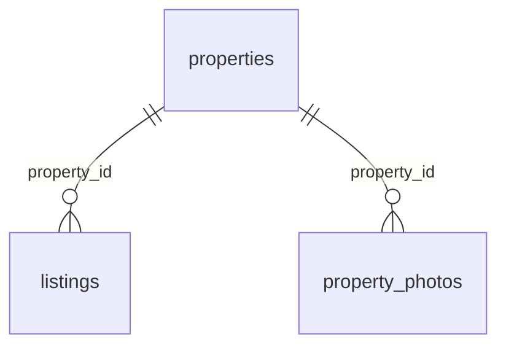

# База данных простыми словами

## Что такое SQLite

SQLite хранит таблицы в одном файле. Здесь это `data/apartments.sqlite3`. Отдельный сервер базы устанавливать и запускать не нужно: C++ вызывает функции библиотеки SQLite, а библиотека читает и записывает файл.

DB Browser for SQLite — отдельное приложение для просмотра того же файла. Оно не заменяет библиотеку, с которой собирается C++. Рабочий файл не хранится в Git: его можно воспроизвести из SQL-схемы и C++ генератора.

## Какие таблицы созданы

Таблица похожа на лист Excel: **строка** — одна запись, **столбец** — одно свойство. `id` — уникальный номер записи, первичный ключ (`PRIMARY KEY`). Не следует считать номера последовательными без пропусков.

| Таблица | Одна строка означает | Основные столбцы |
| --- | --- | --- |
| `properties` | Одну физическую квартиру или дом | `id`, `kind`, `address`, `district`, `area`, `rooms`, `floor`, `description`, `latitude`, `longitude` |
| `listings` | Одно предложение аренды или продажи | `id`, `property_id`, `deal_type`, `price`, `status`, `created_at` |
| `property_photos` | Одну фотографию объекта | `id`, `property_id`, `url`, `caption`, `sort_order` |

В начальном наборе 12 объектов, 12 объявлений, 36 записей фотографий. Фотографии лежат в `public/images`; в базе хранится путь вида `/images/kitchen.jpg`, а не содержимое JPEG. Четыре иллюстрации переиспользуются. Их связь с учебными адресами вымышлена, координаты приблизительные.

`kind` принимает `apartment` (квартира) или `house` (дом). Площадь хранится в квадратных метрах. `floor = 0` у демонстрационных домов означает «объект целиком», а не число этажей дома. Для квартиры `floor` — её этаж.

`deal_type`: `rent` — аренда, `sale` — продажа. `price` — **целое положительное число драмов**: месячная плата при аренде или стоимость целого объекта при продаже. Целое число удобно для денег: оно не даёт ошибок двоичного округления дробных чисел.

`status`: `available` — доступно, `reserved` — забронировано, `closed` — закрыто. Сейчас сервер показывает только `available`. Самих операций бронирования пока нет.

## Зачем отделять объект от объявления

Адрес, площадь и комнаты относятся к физической квартире. Цена и тип сделки относятся к предложению. Если квартиру перепродают, это та же квартира, но уже новое предложение.

Например, квартира `properties.id = 7` может иметь закрытое объявление `listings.id = 7` и новое объявление `listings.id = 13`. У обоих `property_id = 7`. Поэтому сохраняется история, а адрес и фотографии не приходится копировать.



Это связи «один ко многим»: у одного объекта может быть несколько объявлений за всё время и несколько фотографий. `REFERENCES properties(id)` — внешний ключ: значение `property_id` обязано указывать на существующий объект.

`ON DELETE RESTRICT` не разрешает удалить объект, пока на него ссылаются объявления или фотографии. `CHECK (price > 0)` запрещает неположительную цену. `UNIQUE (property_id, sort_order)` не даёт двум фото одного объекта занять одну позицию.

Частичный уникальный индекс `one_open_listing_per_property` запрещает два объявления одного объекта со статусом `available` или `reserved`. Закрытые строки остаются в истории. Это только часть будущей защиты: операции бронирования, проверки пользователя и транзакции будут добавлены отдельно.

## Как открыть файл в DB Browser

1. Сначала подготовьте базу командой `./build/apartment_server --init-db` из корня проекта, если ещё не запускали сервер.
2. Запустите DB Browser for SQLite → **Open Database / Открыть базу данных**.
3. Выберите `/Users/khoren/Documents/apartment-platform/data/apartments.sqlite3`.
4. В **Database Structure / Структура БД** видны три таблицы и индексы. Раскройте таблицу, чтобы увидеть её столбцы.
5. В **Browse Data / Просмотр данных** выберите `properties`, `listings` или `property_photos` в списке таблиц.
6. В **Execute SQL / Выполнить SQL** вставьте запрос ниже и нажмите кнопку запуска ▶. `SELECT` ничего не изменяет.

```sql
SELECT id, address, district, area, rooms
FROM properties
ORDER BY id;
```

Читается так: «выбери столбцы id, адрес, район, площадь и комнаты **из** таблицы объектов и **упорядочь** по id». Вернётся 12 строк, если база содержит только исходные данные.

Если редактируете строки вручную, нажмите **Write Changes / Записать изменения**, чтобы C++ увидел сохранённые правки. Незавершённое редактирование может удерживать блокировку базы. Для обычного просмотра сохранять ничего не нужно. При изменениях сервером обновите вкладку просмотра данных.

## Несколько полезных запросов

Количество объектов:

```sql
SELECT COUNT(*) AS object_count FROM properties;
```

`COUNT(*)` считает строки, `AS` задаёт понятное имя столбца результата.

Соединить объявление с адресом:

```sql
SELECT l.id, p.address, p.district, l.deal_type, l.price, l.status
FROM listings AS l
JOIN properties AS p ON p.id = l.property_id
ORDER BY l.id;
```

`l` и `p` — короткие имена таблиц. `JOIN ... ON` добавляет к объявлению данные того объекта, чей `id` совпал с `property_id`.

Выбрать доступную аренду до 300 000 драмов в месяц:

```sql
SELECT p.address, l.price
FROM listings AS l
JOIN properties AS p ON p.id = l.property_id
WHERE l.deal_type = 'rent' AND l.status = 'available' AND l.price <= 300000
ORDER BY l.price ASC, l.id ASC;
```

`WHERE` оставляет подходящие строки; `AND` означает «оба условия выполняются». `ASC` — по возрастанию, `DESC` — по убыванию. Второй столбец сортировки `id` задаёт однозначный порядок при равных ценах. На текущем сайте пока есть только выбор аренды/продажи; этот более сложный запрос — пример для изучения SQL.

Фотографии объекта № 1:

```sql
SELECT url, caption, sort_order
FROM property_photos
WHERE property_id = 1
ORDER BY sort_order;
```

Проверка ссылок и файла:

```sql
PRAGMA foreign_key_check;
PRAGMA integrity_check;
```

Первый запрос при отсутствии нарушений не возвращает строк; второй должен вернуть `ok`.

## Как C++ выполняет SQL

Путь одного запроса:

1. `public/app.js` вызывает `fetch('/api/listings?type=rent')`.
2. Drogon находит обработчик `/api/listings` в `src/main.cpp`.
3. C++ проверяет `type` и открывает `Database` для нужного файла.
4. Конструктор `Database` выполняет `PRAGMA foreign_keys = ON` и проверяет результат. Это требуется **для каждого соединения**: включение в DB Browser не включает его в C++ и наоборот. [Документация SQLite](https://www.sqlite.org/foreignkeys.html).
5. `Database::listings` в `src/database.cpp` соединяет три таблицы и передаёт параметр SQLite. `LEFT JOIN` сохраняет объявление в результате даже при отсутствии фотографий.
6. C++ собирает строки в `std::vector<Listing>`, преобразует в JSON и возвращает HTTP-ответ.
7. JavaScript создаёт карточки через DOM и `textContent`. В браузере нет SQL и хардкодированного списка квартир.

Суть параметризованного запроса:

```cpp
Statement query(db.handle(), "SELECT id FROM listings WHERE deal_type = ?1");
query.bind(1, std::string("rent"));
while (query.step()) {
    auto id = query.integer(0);
    // Используем полученный id.
}
```

`?1` — место для первого значения, `bind` передаёт значение отдельно от текста SQL. Даже кавычки внутри значения останутся данными и не станут новой SQL-командой. Нельзя строить SQL склеиванием с текстом пользователя. Внутри небольшой обёртки используются `sqlite3_prepare_v2`, `sqlite3_bind_*`, `sqlite3_step`, `sqlite3_finalize`.

Обёртка `Statement` освобождает запрос в деструкторе; `Database` закрывает соединение в деструкторе. Это RAII — привязка ресурса ко времени жизни C++ объекта. В проекте нет собственного ORM или многоэтажных слоёв сервисов. Фиксированные команды схемы и транзакций выполняются через `execute`; входные значения — только через `bind`.

## Создание базы и повторный запуск

`PRAGMA user_version` — число версии схемы внутри файла SQLite. Это встроенное свойство базы, отдельная служебная таблица не нужна. Новая база имеет версию 0. C++ выполняет `sql/001_initial.sql` внутри транзакции, создаёт таблицы и устанавливает версию 1. При повторном запуске схема не создаётся заново. Неизвестная версия приводит к понятной ошибке; сервер не пытается молча пересоздать файл.

Изменения схемы на следующих этапах нужно оформлять новыми миграциями, а не удалением пользовательской базы. `001_initial.sql` описывает первоначальную версию, а не сброс данных.

`src/seed.cpp` — воспроизводимый генератор 12 объектов. `demo_key` (например, `demo-001`) — постоянная метка демонстрационной записи. `INSERT ... ON CONFLICT(demo_key) DO NOTHING` означает «если такая метка уже есть, пропусти вставку». Для существующего объекта генератор также пропускает его объявления и фотографии. Он не исправляет вручную удалённые дочерние строки и не восстанавливает старую цену. При полном удалении демонстрационного объекта с дочерними строками его метка исчезнет и следующая подготовка создаст его снова.

Все новые демообъекты вставляются в одной транзакции:

- `BEGIN IMMEDIATE` начинает операцию записи и получает блокировку писателя.
- Вставляются связанные объекты, объявления и фото.
- `COMMIT` сохраняет весь набор.
- При ошибке `ROLLBACK` отменяет все вставки этого запуска. Половина набора не останется в базе.

Транзакция — «всё или ничего». SQLite допускает одного писателя одновременно; `busy_timeout = 5000` позволяет подождать освобождения блокировки до пяти секунд. Это не заменяет будущую проверку прав и условий бронирования.

## Что предусмотрено для следующих этапов

Таблиц пользователей и бронирований сейчас нет. Планируется новая миграция с `users` и `bookings`. В бронировании будут `user_id`, `listing_id`, `property_id`, состояние и даты. Пользователь будет связан с бронированием, а бронирование — с историческим объявлением и объектом. Составной внешний ключ на пару `(listing_id, property_id)` и уникальный индекс активного бронирования объекта исключат несогласованные ссылки и дубли.

Только транзакция бронирования с условным изменением состояния и проверкой числа изменённых строк сможет гарантировать одного победителя. Отдельный тест одновременного бронирования запланирован на этап 4. Текущие тесты проверяют основу и не доказывают ещё не реализованное бронирование.
