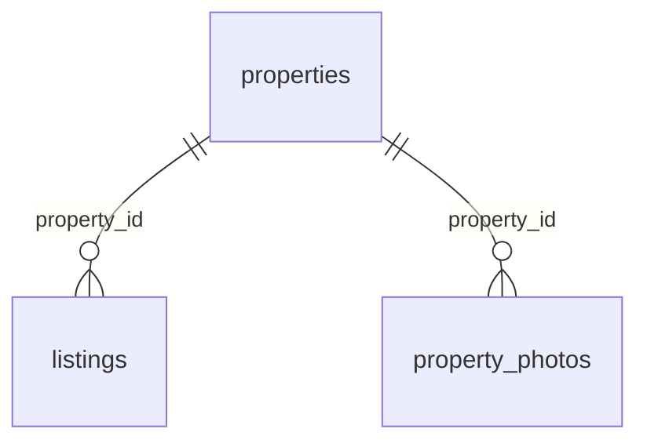

# База данных простыми словами

## Что такое SQLite

SQLite хранит таблицы в одном файле. Здесь это `data/apartments.sqlite3`. Отдельный сервер базы устанавливать и запускать не нужно: C++ вызывает функции библиотеки SQLite, а библиотека читает и записывает файл.

DB Browser for SQLite — отдельное приложение для просмотра того же файла. Оно не заменяет библиотеку, с которой собирается C++. Рабочий файл не хранится в Git: его можно воспроизвести из SQL-схемы и C++ генератора.

## Какие таблицы созданы

Таблица похожа на лист Excel: **строка** — одна запись, **столбец** — одно свойство. `id` — уникальный номер записи, первичный ключ (`PRIMARY KEY`). Не следует считать номера последовательными без пропусков.

| Таблица | Одна строка означает | Основные столбцы |
| --- | --- | --- |
| `properties` | Одну физическую квартиру или дом | `id`, `kind`, `address`, `district`, `area`, `rooms`, `floor`, `description`, `latitude`, `longitude` |
| `listings` | Одно предложение аренды или продажи | `id`, `property_id`, `deal_type`, `price`, `status`, `created_at` |
| `property_photos` | Одну фотографию объекта | `id`, `property_id`, `url`, `caption`, `sort_order` |

В демонаборе второго этапа 1000 объектов, 1000 первоначальных объявлений, 3000 записей фотографий. Первые 12 объектов сохранены с первого этапа. Фотографии лежат в `public/images`; в базе хранится путь вида `/images/kitchen.jpg`, а не содержимое JPEG. Четыре иллюстрации переиспользуются. Их связь с учебными адресами вымышлена, координаты приблизительные.

`kind` принимает `apartment` (квартира) или `house` (дом). Площадь хранится в квадратных метрах. `floor = 0` у демонстрационных домов означает «объект целиком», а не число этажей дома. Для квартиры `floor` — её этаж.

`deal_type`: `rent` — аренда, `sale` — продажа. `price` — **целое положительное число драмов**: месячная плата при аренде или стоимость целого объекта при продаже. Целое число удобно для денег: оно не даёт ошибок двоичного округления дробных чисел.

`status`: `available` — доступно, `reserved` — забронировано, `closed` — закрыто. Каталог показывает только `available`, а отдельная страница объявления показывает любой из трёх статусов. Самих операций бронирования пока нет.

## Зачем отделять объект от объявления

Адрес, площадь и комнаты относятся к физической квартире. Цена и тип сделки относятся к предложению. Если квартиру перепродают, это та же квартира, но уже новое предложение.

Например, квартира `properties.id = 7` может иметь закрытое объявление `listings.id = 7` и новое объявление `listings.id = 1001`. У обоих `property_id = 7`. Поэтому сохраняется история, а адрес и фотографии не приходится копировать.



Это связи «один ко многим»: у одного объекта может быть несколько объявлений за всё время и несколько фотографий. `REFERENCES properties(id)` — внешний ключ: значение `property_id` обязано указывать на существующий объект.

`ON DELETE RESTRICT` не разрешает удалить объект, пока на него ссылаются объявления или фотографии. `CHECK (price > 0)` запрещает неположительную цену. `UNIQUE (property_id, sort_order)` не даёт двум фото одного объекта занять одну позицию.

Частичный уникальный индекс `one_open_listing_per_property` запрещает два объявления одного объекта со статусом `available` или `reserved`. Закрытые строки остаются в истории. Это только часть будущей защиты: операции бронирования, проверки пользователя и транзакции будут добавлены отдельно.

## Как открыть файл в DB Browser

1. Сначала подготовьте базу командой `./build/apartment_server --init-db` из корня проекта, если ещё не запускали сервер.
2. Запустите DB Browser for SQLite → **Open Database / Открыть базу данных**.
3. Выберите `/Users/khoren/Documents/apartment-platform/data/apartments.sqlite3`.
4. В **Database Structure / Структура БД** видны три таблицы и индексы. Раскройте таблицу, чтобы увидеть её столбцы.
5. В **Browse Data / Просмотр данных** выберите `properties`, `listings` или `property_photos` в списке таблиц.
6. В **Execute SQL / Выполнить SQL** вставьте запрос ниже и нажмите кнопку запуска ▶. `SELECT` ничего не изменяет.

```sql
SELECT id, address, district, area, rooms
FROM properties
ORDER BY id;
```

Читается так: «выбери столбцы id, адрес, район, площадь и комнаты **из** таблицы объектов и **упорядочь** по id». Вернётся 1000 строк, если база содержит только исходные данные.

Если редактируете строки вручную, нажмите **Write Changes / Записать изменения**, чтобы C++ увидел сохранённые правки. Незавершённое редактирование может удерживать блокировку базы. Для обычного просмотра сохранять ничего не нужно. При изменениях сервером обновите вкладку просмотра данных.

## Несколько полезных запросов

Количество объектов:

```sql
SELECT COUNT(*) AS object_count FROM properties;
```

`COUNT(*)` считает строки, `AS` задаёт понятное имя столбца результата.

Соединить объявление с адресом:

```sql
SELECT l.id, p.address, p.district, l.deal_type, l.price, l.status
FROM listings AS l
JOIN properties AS p ON p.id = l.property_id
ORDER BY l.id;
```

`l` и `p` — короткие имена таблиц. `JOIN ... ON` добавляет к объявлению данные того объекта, чей `id` совпал с `property_id`.

Выбрать доступную аренду до 300 000 драмов в месяц:

```sql
SELECT p.address, l.price
FROM listings AS l
JOIN properties AS p ON p.id = l.property_id
WHERE l.deal_type = 'rent' AND l.status = 'available' AND l.price <= 300000
ORDER BY l.price ASC, l.id ASC;
```

`WHERE` оставляет подходящие строки; `AND` означает «оба условия выполняются». `ASC` — по возрастанию, `DESC` — по убыванию. Второй столбец сортировки `id` задаёт однозначный порядок при равных ценах. На сайте второго этапа эти условия доступны в форме фильтров; сортировка и отбор выполняются на сервере.

Фотографии объекта № 1:

```sql
SELECT url, caption, sort_order
FROM property_photos
WHERE property_id = 1
ORDER BY sort_order;
```

Проверка ссылок и файла:

```sql
PRAGMA foreign_key_check;
PRAGMA integrity_check;
```

Первый запрос при отсутствии нарушений не возвращает строк; второй должен вернуть `ok`.

## Как C++ выполняет SQL

Путь одного запроса:

1. `public/app.js` вызывает `fetch('/api/listings?type=rent')`.
2. Drogon находит обработчик `/api/listings` в `src/main.cpp`.
3. C++ проверяет все параметры, создаёт `ListingFilters` и открывает `Database` для нужного файла.
4. Конструктор `Database` выполняет `PRAGMA foreign_keys = ON` и проверяет результат. Это требуется **для каждого соединения**: включение в DB Browser не включает его в C++ и наоборот. [Документация SQLite](https://www.sqlite.org/foreignkeys.html).
5. `Database::listings` в `src/database.cpp` считает подходящие объявления и выбирает страницу. Затем присоединяет фото; `LEFT JOIN` сохраняет объявление даже при отсутствии фотографий. Все значения передаются параметрами.
6. C++ собирает строки в `std::vector<Listing>`, преобразует в JSON и возвращает HTTP-ответ.
7. JavaScript создаёт карточки через DOM и `textContent`. В браузере нет SQL и хардкодированного списка квартир.

Суть параметризованного запроса:

```cpp
Statement query(db.handle(), "SELECT id FROM listings WHERE deal_type = ?1");
query.bind(1, std::string("rent"));
while (query.step()) {
    auto id = query.integer(0);
    // Используем полученный id.
}
```

`?1` — место для первого значения, `bind` передаёт значение отдельно от текста SQL. Даже кавычки внутри значения останутся данными и не станут новой SQL-командой. Нельзя строить SQL склеиванием с текстом пользователя. Внутри небольшой обёртки используются `sqlite3_prepare_v2`, `sqlite3_bind_*`, `sqlite3_step`, `sqlite3_finalize`.

Обёртка `Statement` освобождает запрос в деструкторе; `Database` закрывает соединение в деструкторе. Это RAII — привязка ресурса ко времени жизни C++ объекта. В проекте нет собственного ORM или многоэтажных слоёв сервисов. Фиксированные команды схемы и транзакций выполняются через `execute`; входные значения — только через `bind`.

## Создание базы и повторный запуск

`PRAGMA user_version` — число версии схемы внутри файла SQLite. Это встроенное свойство базы, отдельная служебная таблица не нужна. Новая база имеет версию 0. C++ выполняет `sql/001_initial.sql` внутри транзакции, создаёт таблицы и устанавливает версию 1. Затем `sql/002_catalog_indexes.sql` добавляет индексы и устанавливает версию 2. Если база уже имела версию 1, выполняется только вторая миграция. При повторном запуске схема не создаётся заново. Неизвестная версия приводит к понятной ошибке; сервер не пытается молча пересоздать файл.

Изменения схемы на следующих этапах нужно оформлять новыми миграциями, а не удалением пользовательской базы. `001_initial.sql` описывает первоначальную версию, а не сброс данных.

`src/seed.cpp` — воспроизводимый генератор 1000 объектов. Первые 12 описаны явно, остальные вычисляются по постоянным формулам от номера. Ключи идут от `demo-001` до `demo-1000`; число строк всей базы не используется как ограничение. Пользовательские объекты и будущие новые объявления одного объекта могут увеличивать общий счёт сверх 1000. Дата `created_at` соответствует реальному первому запуску и при повторном заполнении сохраняется. `demo_key` (например, `demo-001`) — постоянная метка демонстрационной записи. `INSERT ... ON CONFLICT(demo_key) DO NOTHING` означает «если такая метка уже есть, пропусти вставку». Для существующего объекта генератор также пропускает его объявления и фотографии. Он не исправляет вручную удалённые дочерние строки и не восстанавливает старую цену. При полном удалении демонстрационного объекта с дочерними строками его метка исчезнет и следующая подготовка создаст его снова.

Все новые демообъекты вставляются в одной транзакции:

- `BEGIN IMMEDIATE` начинает операцию записи и получает блокировку писателя.
- Вставляются связанные объекты, объявления и фото.
- `COMMIT` сохраняет весь набор.
- При ошибке `ROLLBACK` отменяет все вставки этого запуска. Половина набора не останется в базе.

Транзакция — «всё или ничего». SQLite допускает одного писателя одновременно; `busy_timeout = 5000` позволяет подождать освобождения блокировки до пяти секунд. Это не заменяет будущую проверку прав и условий бронирования.

## Как работает полный каталог второго этапа

Полные запросы, готовые для DB Browser: [catalog-queries.sql](catalog-queries.sql). Они только читают данные. В примерах ниже стоят конкретные значения; в C++ вместо них используются `?` и `Statement::bind`.

### WHERE и AND: оставить только подходящие объявления

```sql
SELECT l.id, p.address, p.district, p.rooms, l.price, p.area
FROM listings AS l
JOIN properties AS p ON p.id = l.property_id
WHERE l.status = 'available'
  AND l.deal_type = 'rent'
  AND p.district = 'Кентрон'
  AND l.price >= 200000
  AND l.price <= 500000
  AND p.rooms = 2
ORDER BY l.price ASC, l.id ASC
LIMIT 24 OFFSET 0;
```

Читаем последовательно: взять объявления и их объекты; оставить доступную аренду в Кентроне, с двумя комнатами и ценой от 200 000 до 500 000 драмов включительно; упорядочить и показать первые 24.

`WHERE` начинает условия отбора, `AND` требует выполнения **всех** условий одновременно. Поэтому выбор района не отменяет цену или комнаты. Границы цены включены благодаря `>=` и `<=`. Комнаты и район сравниваются точно через `=`. Невыбранный фильтр вообще не добавляется в SQL: в `whereClause` дописываются только фиксированные фрагменты, а `bindFilters` передаёт значения в том же порядке. Ни район, ни цена не склеиваются с текстом SQL.

### ORDER BY: выбрать порядок всего результата

В API есть четыре значения `sort`:

| Значение | SQL внутри выборки страницы |
| --- | --- |
| `price_asc` | `ORDER BY l.price ASC, l.id ASC` |
| `price_desc` | `ORDER BY l.price DESC, l.id ASC` |
| `area_asc` | `ORDER BY p.area ASC, l.id ASC` |
| `area_desc` | `ORDER BY p.area DESC, l.id ASC` |

Цена хранится в `listings`, площадь — в `properties`, поэтому используются разные короткие имена таблиц. `ASC` — от меньшего к большему, `DESC` — от большего к меньшему. Во всех четырёх вариантах дополнительный `l.id ASC` одинаков: при равенстве основного значения первым идёт объявление с меньшим номером.

Сортировку выполняет SQLite **до** разделения на страницы. Если отсортировать только 24 карточки в JavaScript, нельзя гарантировать, что на следующей странице не окажется более дешёвое предложение. Для нашего каталога серверная сортировка даёт правильный общий порядок.

Имена столбцов и `ASC`/`DESC` не передаются как обычные значения `?`. В C++ есть явный белый список четырёх готовых фрагментов SQL. Строка вроде `sort=price;DROP TABLE listings` не принадлежит списку и получает HTTP 400.

### LIMIT и OFFSET: взять одну страницу

`LIMIT 24` означает «вернуть не больше 24 объявлений», `OFFSET 24` — «пропустить первые 24». Формула в C++:

```text
offset = (page - 1) * page_size
```

Для первой страницы смещение 0, для второй 24, для третьей 48. Полный пример второй страницы по убыванию площади:

```sql
SELECT l.id, p.address, p.area, l.price
FROM listings AS l
JOIN properties AS p ON p.id = l.property_id
WHERE l.status = 'available'
ORDER BY p.area DESC, l.id ASC
LIMIT 24 OFFSET 24;
```

`LIMIT` и `OFFSET` тоже связываются параметрами. Сервер разрешает `page_size` от 1 до 100 и `page` от 1 до 1 000 000; расчёт использует 64-битное целое. Далёкая допустимая страница возвращает пустой список, а не ошибку 500. Размер страницы по умолчанию — 24.

`OFFSET` выбран за простоту и возможность переходить сразу к номеру страницы. При миллионах строк и больших смещениях он может быть затратным: движку приходится проходить пропускаемые записи. Тогда имеет смысл рассмотреть пагинацию по последнему значению сортировки и id, но для учебных 1000 объектов это лишнее усложнение.

### COUNT: узнать общее число совпадений

```sql
SELECT COUNT(*) AS total
FROM listings AS l
JOIN properties AS p ON p.id = l.property_id
WHERE l.status = 'available'
  AND l.deal_type = 'rent'
  AND p.district = 'Кентрон'
  AND l.price >= 200000
  AND l.price <= 500000
  AND p.rooms = 2;
```

`COUNT(*)` считает строки после `WHERE`. Здесь нет `LIMIT/OFFSET`, потому что нужно число **всех** совпадений. Фотографии тоже не присоединяются: иначе три фото могли бы утроить счётчик.

API возвращает `total` — все совпадения, `count` — объявления текущей страницы. Число страниц считается как `(total + page_size - 1) / page_size` с целочисленным делением. Для 1000 и 24 это 42 страницы: 41 полная и последняя из 16 объявлений. При `total = 0` страниц 0.

`COUNT` и запрос страницы выполняются в одной транзакции чтения (`BEGIN` → два SELECT → `COMMIT`). Так внутри одного ответа список и количество относятся к одному снимку базы. Между разными HTTP-запросами данные могут измениться, и страницы со смещением могут сдвинуться. Стабильный `id` разрешает равенство цен, но не замораживает базу навсегда.

### Почему фотографии присоединяются после LIMIT

В фактическом запросе C++ используется `WITH page AS (...)`. Это временное имя результата **одного запроса**, не новая сохранённая таблица. Внутри `page` выбираются и сортируются объявления, затем применяются `LIMIT/OFFSET`. Снаружи выполняется:

```sql
-- Этот фрагмент завершает WITH page AS (...), полный запрос — № 2 в catalog-queries.sql.
SELECT page.*, ph.url, ph.caption
FROM page
LEFT JOIN property_photos AS ph ON ph.property_id = page.property_id
ORDER BY page.price ASC, page.id ASC, ph.sort_order ASC;
```

Внешняя сортировка соответствует выбранной внутренней и добавляет порядок фотографий. Для 24 объявлений с тремя фото SQL вернёт 72 строки. `readListings` в C++ объединит соседние строки с одинаковым `id` в один `Listing` с массивом фото. Итоговый JSON содержит 24 объявления. `LEFT JOIN` сохраняет строку даже при отсутствии фото — тогда массив пустой, интерфейс показывает заглушку.

### Индексы и EXPLAIN QUERY PLAN

Индекс похож на отдельный упорядоченный указатель: он помогает найти нужные строки, не перебирая всю таблицу. Индекс занимает место и требует обновления при записи, поэтому создавать индекс на каждое возможное сочетание полей не нужно. SQLite выбирает план с учётом запроса и доступных индексов; оценка также может учитывать статистику. [Описание планировщика SQLite](https://www.sqlite.org/queryplanner.html).

Миграция 2 добавляет:

| Индекс | Поля | Для каких запросов |
| --- | --- | --- |
| `listings_available_price` | `(price, id)`, только `available` | Цена и сортировка доступного каталога без выбранной сделки |
| `listings_available_type_price` | `(deal_type, price, id)`, только `available` | Равенство типа сделки плюс диапазон/порядок цены |
| `properties_district_rooms` | `(district, rooms, id)` | Поиск по району, в том числе вместе с комнатами |

Порядок полей составного индекса важен: сначала район, внутри района — комнаты. Поэтому этот индекс полезен для района и пары район+комнаты, но не является специально подобранным индексом для одного только числа комнат. Два ценовых индекса нужны для разных условий: индекс, начинающийся с типа сделки, не задаёт единого порядка цены среди обеих сделок сразу.

Сохраняются индексы первого этапа: `listings_property_id` для связи, уникальный `one_open_listing_per_property` для целостности, автоматический уникальный индекс фотографий `(property_id, sort_order)`, индексы `demo_key` и первичные ключи.

Пример только для чтения:

```sql
EXPLAIN QUERY PLAN
SELECT l.id, p.address, l.price
FROM listings AS l
JOIN properties AS p ON p.id = l.property_id
WHERE l.status = 'available'
ORDER BY l.price ASC, l.id ASC
LIMIT 24 OFFSET 0;
```

`SEARCH ... USING INDEX` означает поиск с помощью индекса. `SCAN ... USING INDEX` — проход по индексу, например в порядке цены. `USE TEMP B-TREE FOR ORDER BY` означает отдельную временную сортировку. Это описание способа выполнения, а не замер времени. [Справка EXPLAIN QUERY PLAN](https://www.sqlite.org/eqp.html).

На нашем фактическом наборе и SQLite 3.53.4 выполнены восемь планов: [query-plans.md](query-plans.md). Для цены по возрастанию выбран ценовой индекс; для типа+диапазона — составной индекс; район+комнаты используют `properties_district_rooms`. Для площади используется временная сортировка. При `price DESC, id ASC` также нужна досортировка равных цен: обратный проход по индексу сам по себе дал бы `id DESC`. После присоединения фото план содержит дополнительную сортировку их порядка.

Отдельный индекс площади сейчас не добавлен: площадь и id объявления находятся в разных таблицах, и один такой индекс не гарантирует устранение сортировки соединённого результата. Это разумный небольшой набор индексов для текущих запросов, а не утверждение об универсально самом быстром способе. При росте данных следует повторить планы и измерить время на реальной нагрузке.

## Что предусмотрено для следующих этапов

Таблиц пользователей и бронирований сейчас нет. Планируется новая миграция с `users` и `bookings`. В бронировании будут `user_id`, `listing_id`, `property_id`, состояние и даты. Пользователь будет связан с бронированием, а бронирование — с историческим объявлением и объектом. Составной внешний ключ на пару `(listing_id, property_id)` и уникальный индекс активного бронирования объекта исключат несогласованные ссылки и дубли.

Только транзакция бронирования с условным изменением состояния и проверкой числа изменённых строк сможет гарантировать одного победителя. Отдельный тест одновременного бронирования запланирован на этап 4. Текущие тесты проверяют основу и не доказывают ещё не реализованное бронирование.
